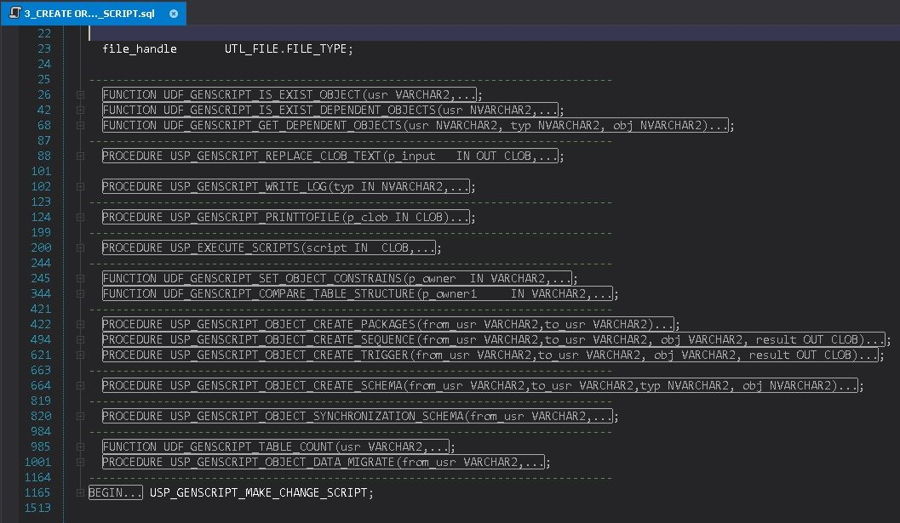

# Script Generator for Database Structure and Data Transfer

## 🔍 About the Project
This project was designed to **transfer database structures and data** between two environments of the same type (SQL Server ↔ SQL Server or Oracle ↔ Oracle).  
It helps with synchronizing development and production databases or preparing clean testing environments.

The main focus was to **automatically generate scripts** for database objects and data, based on object dependencies and defined rules.

> ⚠️ Note: Due to confidentiality, the full source code cannot be shared.  
> Instead, this repository provides documentation and a sample code snippet (dependency graph builder) to illustrate part of the implementation.

---

## ⚙️ Technologies Used
- **SQL Server side**  
  - T-SQL for core logic  
  - PowerShell for saving scripts  
  - SMO (SQL Server Management Objects) for object scripting  

- **Oracle side**  
  - PL/SQL for core logic  
  - PowerShell for file generation  
  - Oracle built-in functions to extract object definitions  

---

## 🧠 Challenges Addressed
- Building a **dependency graph** between objects (tables, views, packages, triggers, …).  
- Managing complex relations and schema matching.  
- Handling **large data types** like CLOB and BLOB in Oracle.  
- Respecting foreign key constraints and correct object ordering.  
- Supporting **batching** for large table data transfer.  

---

## 🔄 Process Workflow
1. **Preparation Phase** – create helper/configuration tables.  
2. **Dependency Analysis** – find object dependencies using system views, CTEs, and cursors.  
3. **Graph Building** – organize objects from independent to dependent.  
4. **Object Processing** – decide whether to `CREATE`, `ALTER`, or `INSERT`.  
5. **Constraint Handling** – disable FKs during inserts, re-enable afterward.  
6. **Oracle specifics** – handle packages, triggers, and sequences carefully.  

---

## 📥 Script Generation Details
- **SQL Server** – SMO was accurate but slower on large objects.  
- **Oracle** – Built-in functions were faster but less flexible.  
- **Large Tables** – INSERT scripts generated in small batches.  

---

## 🎯 Use Cases
- Synchronization between dev and prod  
- Versioning and deployment  
- Environment setup for QA, training, or testing  

---

## 🚀 Results
- Reduced manual effort in deployment and synchronization.  
- Improved speed and accuracy.  
- Provided a flexible base to extend with more features (data comparison, security, …).  

---

## 📌 Sample Code: Dependency Graph Builder

Below is a **simplified example** (PL/SQL) showing how the **dependency graph** was built for Oracle objects:

[Create dependency graph Script - Oracle](./scripts/Filling-objects-graph.sql)

[SP to create powershell script to use SMO-SQL Server](./scripts/GENSCRIPT.USP_MAKE_POWERSHELL_SCRIPT.sql)

---

## Project Gallery

-----------------------------------------------
